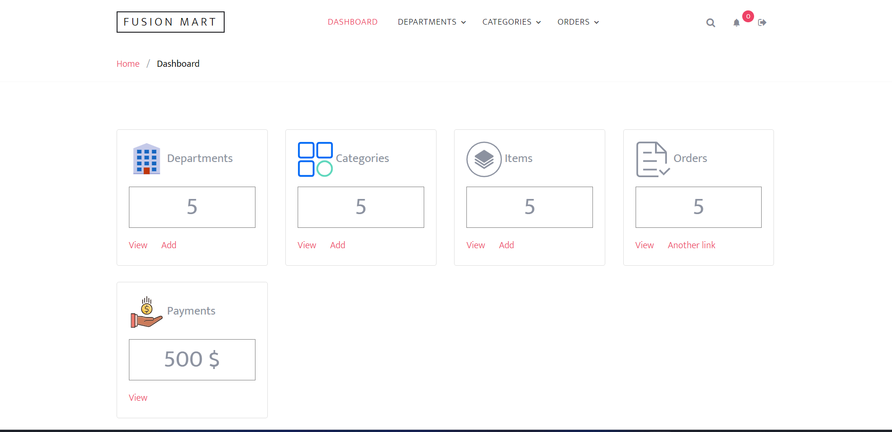
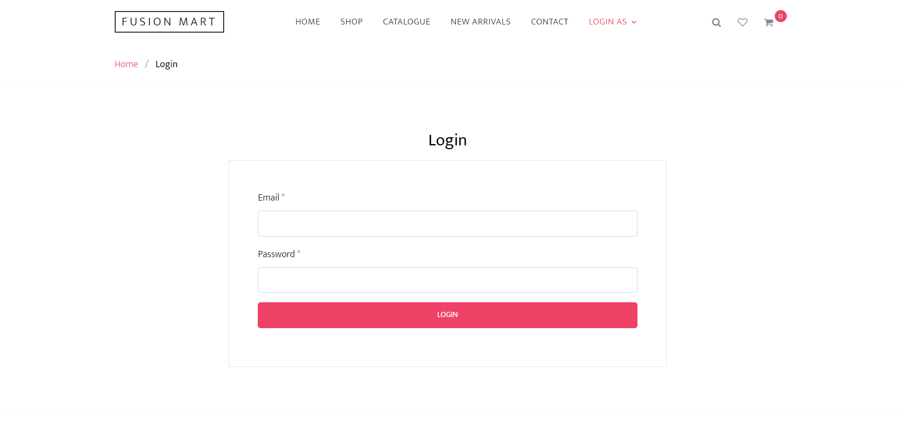
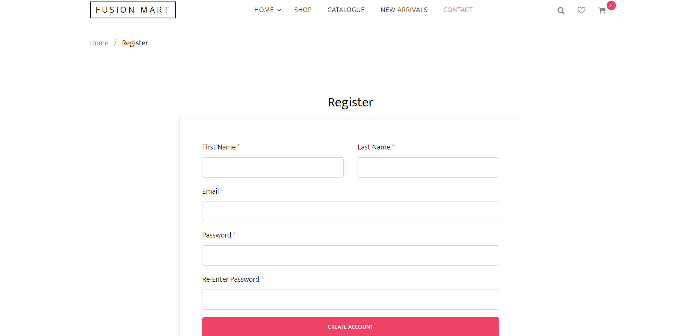
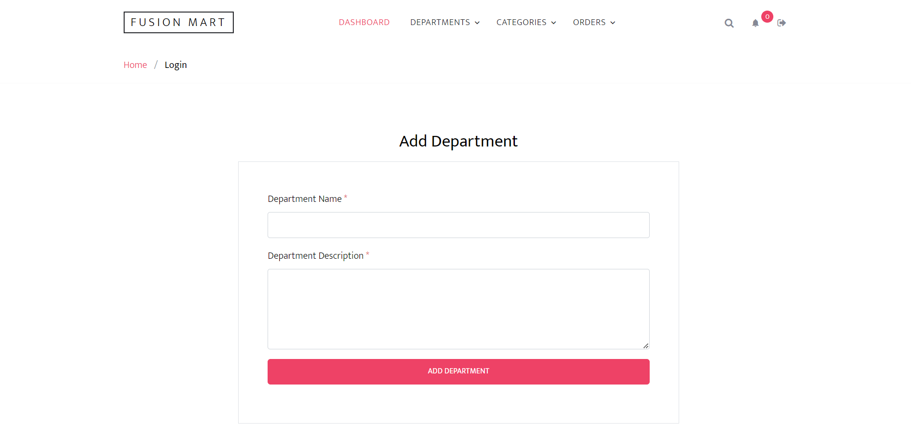
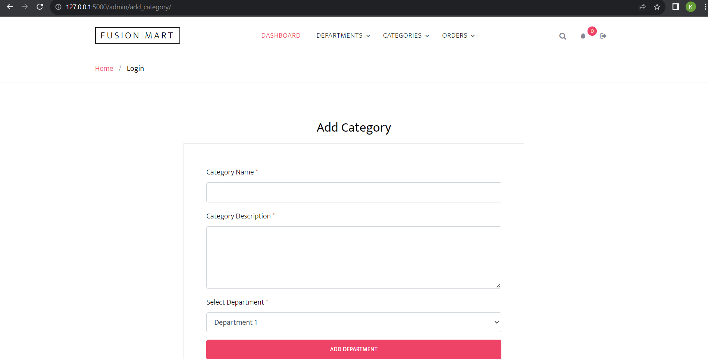
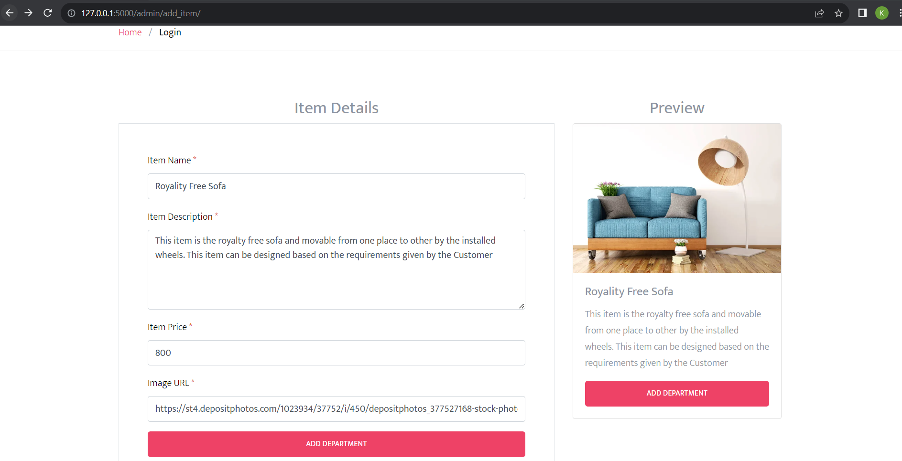

Ecommerce Website (Departmental Store) with mentioned features.

Technologies and Tools Used

Front End:	HTML, CSS, BOOTSTRAP, JAVA SCRIPT

Backend:	PYTHON, FLASK

Database:	SQLITE3

Python Modules:	FLASK, SQL ALCHEMY, SQLITE3

Tools:		PYCHARM, MySQL community server, Postman, DB Visualizer


## Installation

Use the pip command to install the dependencies that are listed down in requirements.txt file

```bash
python -m venv venv
```

```bash
pip install -r requirements.txt
```

## Start the application
```bash
.\venv\Scripts\activate
```

```bash
python main.py

 * Serving Flask app 'main'
 * Debug mode: on
WARNING: This is a development server. Do not use it in a production deployment. Use a production WSGI server instead.
 * Running on http://127.0.0.1:5000
Press CTRL+C to quit
 * Restarting with stat
 * Debugger is active!
 * Debugger PIN: 470-276-558
```

### URLS

##### The UI pages can be accessed by clicking on the below links :

User Registration - http://localhost:5000/auth/register

User Login - http://localhost:5000/auth/login

Admin Dashboard - http://localhost:5000/admin/

### Images

##### Admin Dashboard


##### Login Page


##### Register Page


##### Add Department Page


##### Add Category Page


##### Add Item Page

